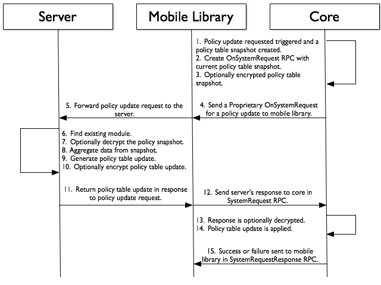

# Policy Table Update
Periodically changes will be made to a Policy Table, either by the Policy Server or SDL Core.  In order to synchronize the two tables, a Policy Table update must be performed.  An update is triggered by Core by either an application connecting for the first time, or by one of the [Policy Table update configurations](../policy-table/module-config/#Policy-Table-Update-Configurations), or by a user's request.  When requesting a Policy Table update, SDL Core sends its current Policy Table, called a Policy Table snapshot, to the server.  The server records any aggregate usage data as needed or designed, then responds to the request with a Policy Table update that contains the latest [module config](../policy-table/module-config), [functional groupings](../policy-table/functional-groupings), [application policies](../policy-table/application-policies), and [consumer friendly messages](../policy-table/consumer-friendly-messages).  The application policies section will only contain information for the current list of applications in the received Policy Table snapshot.  In addition, the consumer friendly messages will only be included if an update is required, meaning the received Policy Table snapshot has an older version than the server.

|||
Policy Table Update Sequence Diagram

|||

## Policy Table Update Sequence Diagram Steps
1. A Policy Table update is triggered by SDL Core and a snapshot of the current Policy Table is created.  The snapshot includes the entire local Policy Table with one exception.  Only the version number property of the [consumer friendly messages](../policy-table/consumer-friendly-messages) section is included in the snapshot.
2. An OnSystemRequest RPC is created with a request type of proprietary.  The RPC contains a Policy Table snapshot in binary and a URL from one of the endpoints defined in the [module config](../policy-table/module-config).  In addition, HTML request headers can be present to be used when making the request.
3. The RPC's data is, optionally, encrypted using an asynchronous key that only the Policy Server can decrypt.  The URL and headers are not encrypted since they are required by the mobile library to forward the request to the Policy Server.
4. The RPC is then sent to the mobile library.
5. The mobile library will ignore the request body containing the Policy Table snapshot, because it is marked as proprietary, and will forward the request to the URL included in the OnSystemRequest RPC.  If the request fails to send then the mobile library will attempt to retry using the configuration specified in the [module config](../policy-table/module-config).
6. When the server receives the Policy Table update request it will first lookup the module in the server's database using a unique identifier.  If the module is not found an error will be returned in the server's response.
7. If the Policy Table snapshot is encrypted, then the server will use the symmetric key found in the module's database record, the one we just looked up, to decrypt the Policy Table snapshot.  If the data cannot be decrypted, then the data is not from a trusted source and an error is returned in the server's response.
8. The aggregate usage data and vehicle data in the received Policy Table snapshot is recorded to the server's database. Typically [Usage and Error Counts](../policy-table/usage-and-errors), [Device Data](../policy-table/device-data), and [Module Meta](../policy-table/module-meta) contain data to be recorded.
9. A Policy Table update is created based on the received Policy Table snapshot.  Note that only applications listed in the policy snapshot will be included in the update.  In addition, if the consumer friendly messages version number is lower than the version available on the server, then the updated consumer friendly messages will also be included in the policy update.
10. Then the Policy Table update is, optionally, encrypted using an asynchronous key from the module record we previously looked up.
11. Finally the Policy Table update is returned in the response to the policy update request.
12. The mobile library then forwards the server's response to SDL Core using a SystemRequest RPC message.
13. After being received byCore the response body, if encrypted, is decrypted using an asymmetric key.  If the body cannot be decrypted, then the data is not from a trusted source and an error is returned to the mobile library using a SystemRequestResponse RPC.
14. The Policy Table update is applied by replacing the following fields in the local Policy Table with the fields from the Policy Table update:  [module config](../policy-table/module-config), [functional groupings](../policy-table/functional-groupings), and [application policies](../policy-table/application-policies).  In addition, if the [consumer friendly messages](../policy-table/consumer-friendly-messages) section of the Policy Table update contains a **messages** subsection, then the entire consumer friendly messages portion of the local Policy Table will be replaced with the values from the Policy Table update.
15. If the response is valid and everything updates ok, then success is returned to the mobile library using a SystemRequestResponse RPC.
