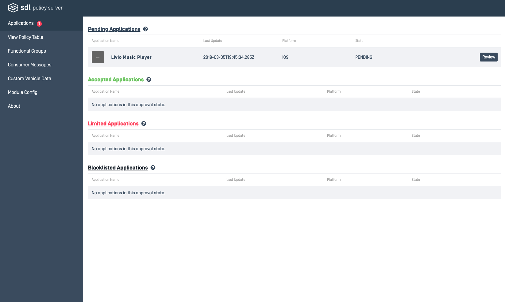
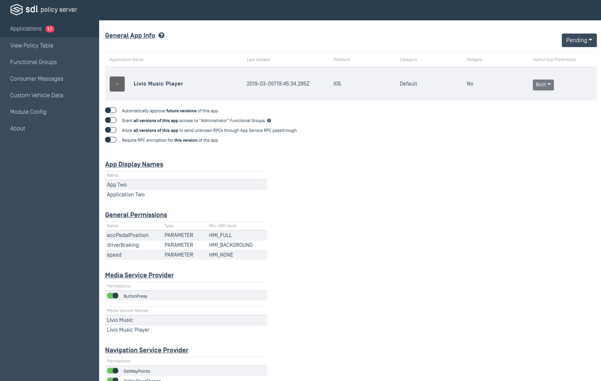

# Applications


This page displays a list of applications pulled from the SHAID server. When initially added, apps will be pending approval. Reviewing each app will give the user a detailed page on the important information associated with the app such as the requested permissions, developer contact information, and preview of what its segment in the Policy Table would look like.

### General App Info


| Property | Definition |
|----------|---------|
| Application Name | The String for which to identify the application. |
| Last Update | The timestamp from when the app information was most recently updated. |
| Platform | Android/IOS |
| Category | Specifies the type of application. eg. Media, Information, Social. |
| Widgets | Whether this app is requesting the use of widgets. |
| Hybrid App Preference | Which app to show on the HMI when the same app is detected on multiple platforms. |
| Endpoint | For cloud/embedded apps, the server endpoint of the app. |
| Transport Type | For cloud/embedded apps, the expected transport type of the server endpoint. |

### Toggles
| Toggle | Notes |
|----------|---------|
| Automatically approve future versions of this app | The current version will still need to be approved manually. |
| Grant all versions of this app access to "Administrator" Functional Groups |  |
| Allow all versions of this app to send unknown RPCs through App Service RPC passthrough |  |
| Require RPC encryption for this version of the app  |  |

### App Display Names
| Property | Definition |
|----------|---------|
| Name   | Alternate strings to identify the application. The app's name must match one of these in order for it to connect to Core. |

### General Permissions
| Property | Definition |
|----------|---------|
| Name | Strings to identify the permission. |
| Type | RPC  |
| Min. HMI Level | BACKGROUND/FULL/NONE/LIMITED |

### Service Provider
Service Provider options appear when an application has requested to be an App Service provider. OEMs may choose which RPCs/events the application is allowed to receive via the permission toggle switches. OEMs should note that disabling all the toggle switches does *not* revoke the application's general ability to act as an App Service Provider, but simply limits the app's abilities regarding that particular Service.

| Property | Definition |
|----------|---------|
| Permissions | An RPC/event related to the app's requested service. |

### Grant Proprietary Functional Groups
| Property | Definition |
|----------|---------|
| Functional Group Name | A functional group that is categorized as a proprietary functional group. |

### Developer Contact Info
| Property | Definition |
|----------|---------|
| Vendor | The name of the developer to contact with regards to this application. |
| Email | The contact email for the Vendor. |
| Phone | The contact phone number for the Vendor. |
| Tech Email | The optional contact email for technical issues regarding the app. |
| Tech Phone | The optional contact phone number for technical issues. |

### Certificates
An application can have a private key and certificate associated with it, if certificate generation is enabled. The certificate is set up to auto renew one day before its expiration, but these values can also be manually renewed by clicking "Generate Key and Certificate", followed by clicking "Save Key and Certificate".

### Policy Table Preview
This is an example of how the app and its required permissions will appear in the Policy Table.
```
{
  "nicknames": [
    "Livio Music",
    "Livio Music Player"
  ],
  "keep_context": true,
  "steal_focus": true,
  "priority": "NONE",
  "default_hmi": "NONE",
  "groups": [
    "AdministratorGroup",
    "AppServiceConsumerGroup",
    "AppServiceProviderGroup",
    "Base-4",
    "DialNumberOnlyGroup",
    "DrivingCharacteristics-3",
    "HapticGroup",
    "Notifications",
    "OnKeyboardInputOnlyGroup",
    "OnTouchEventOnlyGroup"
  ],
  "moduleType": [],
  "RequestType": [],
  "RequestSubType": [],
  "app_services": {
    "MEDIA": {
      "service_names": [
        "Livio Music",
        "Livio Music Player"
      ],
      "handled_rpcs": [
        {
          "function_id": 41
        }
      ]
    },
    "NAVIGATION": {
      "service_names": [
        "Livio",
        "Livio Music and Nav"
      ],
      "handled_rpcs": [
        {
          "function_id": 45
        },
        {
          "function_id": 32784
        },
        {
          "function_id": 46
        }
      ]
    }
  },
  "hybrid_app_preference": "MOBILE"
}
```
## Significance of Approval States
The top right corner of the application's review page contains a drop down allowing the user to change the approval state of the application. See below for what each state signifies.

##### Pending
New applications and updated applications that reach your SDL Policy Server will be granted the approval state of pending. Pending applications are treated like limited applications in that they will not be given any changes requested, but will be given permissions in default functional groups. Pending applications require action performed on them in order for the application to be officially approved or limited.

##### Staging
Applications in the staging state will have their permissions granted when using the staging policy table, but not the production policy table. This mode is useful for testing purposes.

##### Accepted
Applications in the accepted state will have their permissions granted when using both the staging and the production policy table. This state is for applications that are allowed to be used in a production environment.

##### Limited
Limited applications will not receive their requested changes. However, permissions received from the previously accepted version and from default functional groups will still be given. Additional options include providing a reasoning for limiting the application for your future reference. While in the limited state, you also have the option to blacklist the application.

##### Blacklisted
A blacklisted application will not receive any permissions, including permissions from default functional groups. All future update requests will also be blacklisted. This action is reversible.

## New Application Versions
Each time an app is updated on the SDL Developer Portal at smartdevicelink.com, the app's changes will appear in your Policy Server pending re-approval. If an app is from a trusted developer and you would like to always approve future revisions of it, you can choose to "Automatically approve updates" under "General App Info" of the app's review page.

Newer versions of applications that come in will have a state of pending, but that will not affect the statuses granted to its previously approved versions. The latest permitted application will have their changes used for the policy table until a new version's changes are also permitted.